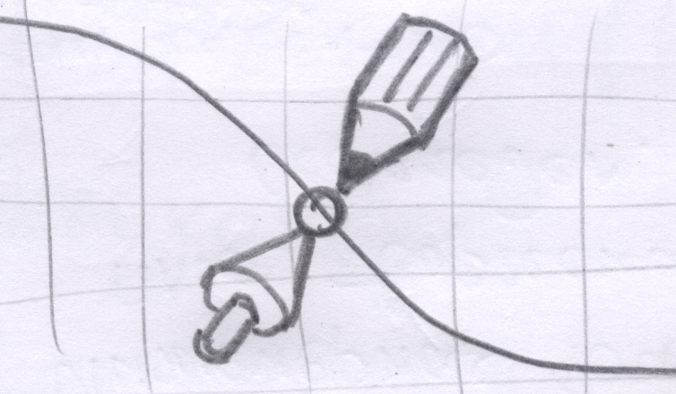

# Точка сборки - 3D

## Cистема для создания 3D стерео иллюстраций   

Система полезна для создания иллюстраций по темам:
- 3D-моделирование
- Черчение, начертательная геометрия
- Математика, геометрия, стереометрия, физика
- Молекулярная химия и биоинженерия
- Анимированные 3D- графики, визуализация данных, BI-презентации
- Разработка в области VR и AR

Для создания иллюстраций используется открытое конструкторское ядро **OpenCascade**. 
Программирование выполняется с помощью языка **Python 3**. 
Просматривать иллюстрации можно в любом современном браузере, поддерживающем **WebGL**.
При просмотре поддерживаются различные **стереоскопические режимы**. 
Вы можете подключить компьютер к **3D телевизору**, **3D проектору** или **Очкам виртуальной реальности** 
и прямо в браузере запустить иллюстрацию в **стерео-режиме**. 
Если Вы владеете режимом Перекрестного взгляда - он тоже есть.

## Пример 1: Построение символа Дао в 3D

Статьи (PDF)
- [Построение символа Дао в 3D](https://headfire.github.io/p3/docs/dao_article.pdf)

Слайды (WebGL)
- [Слайд 01 Контур классического Дао](https://headfire.github.io/p3/v.htm?s=dao_01)
- [Слайд 02 Контур Дао с отступом](https://headfire.github.io/p3/v.htm?s=dao_02)
- [Слайд 03 Принцип построения сечений ](https://headfire.github.io/p3/v.htm?s=dao_03)
- [Слайд 04 Форма Дао из сечений](https://headfire.github.io/p3/v.htm?s=dao_04)
- [Слайд 05 Протягивание поверхности через сечения](https://headfire.github.io/p3/v.htm?s=dao_05)
- [Слайд 06 Окончательная форма Дао](https://headfire.github.io/p3/v.htm?s=dao_06)
- [Слайд 07 Форма Дао с основанием](https://headfire.github.io/p3/v.htm?s=dao_07)

Файлы моделей (STL) 
- [Инь]( https://headfire.github.io/p3/models/dao/exp_001_shape.stl)
- [Янь]( https://headfire.github.io/p3/models/dao/exp_002_shape.stl)
- [Основание]( https://headfire.github.io/p3/models/dao/exp_003_shape.stl)

Не перепутайте Инь и Янь :) (отличий нет, но мало ли чего)

## Для разработчиков

[Установка среды разработки OpenCascade - Python 3.7 - Win64](docs/setup.pdf) 

## Контакты

Cайт проекта: [https://headfire.github.io/point](https://headfire.github.io/point)

Репозиторий проекта: [https://github.com/headfire/point](https://github.com/headfire/point)

E-mail автора: [headfire@yandex.ru](mailto:headfire@yandex.ru)

# Creation point - 3D  / English version

## 3D stereo illustration system
