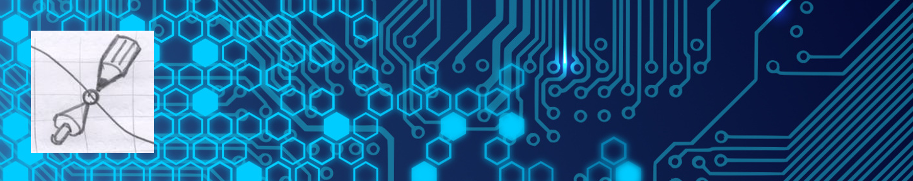
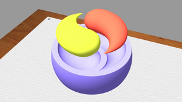
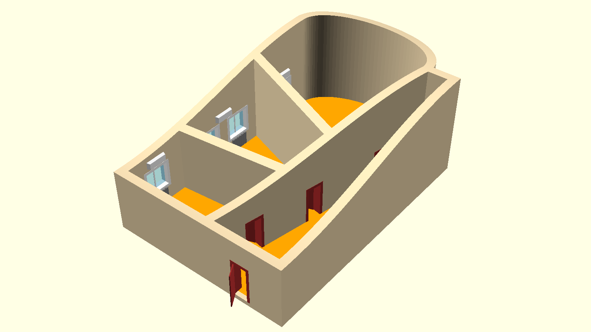
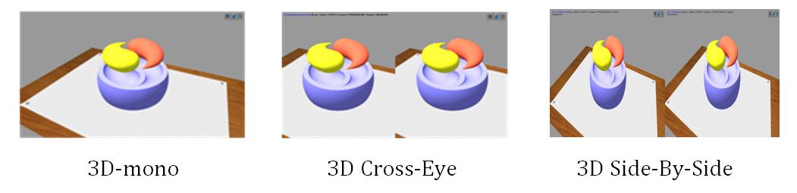

---

---

# Творческая мастерская "Точка сборки 3D"

### Особо прочный сплав из вдохновения, хаоса и конструкторской точности

Результатом работы мастерской "Точка сборки - 3D" являются сувенирные, презентационные, конструкторские
и научные материалы, созданные с применением трехмерного моделирования: STL-модели, DXF-чертежи и развертки, 
инструкции в формате MD и PDF, сылки на видео YouTube,  также самое интересное - 
[трехмерные интерактивные стерео-слайды](#%D0%BF%D1%80%D0%BE-%D1%82%D1%80%D0%B5%D1%85%D0%BC%D0%B5%D1%80%D0%BD%D1%8B%D0%B5-%D0%B8%D0%BD%D1%82%D0%B5%D1%80%D0%B0%D0%BA%D1%82%D0%B8%D0%B2%D0%BD%D1%8B%D0%B5-%D1%81%D1%82%D0%B5%D1%80%D0%B5%D0%BE-%D1%81%D0%BB%D0%B0%D0%B9%D0%B4%D1%8B).

---

## Проект DAO: Идея для сувенира Дао

Статьи (PDF)
- [Построение символа Дао в 3D](https://headfire.github.io/p3/docs/dao_article.pdf)

Слайды (WebGL)
- [Слайд 01 - Контур классического Дао](https://headfire.github.io/p3/v.htm?s=dao_01)
- [Слайд 02 - Контур Дао с отступом](https://headfire.github.io/p3/v.htm?s=dao_02)
- [Слайд 03 - Принцип построения сечений ](https://headfire.github.io/p3/v.htm?s=dao_03)
- [Слайд 04 - Форма Дао из сечений](https://headfire.github.io/p3/v.htm?s=dao_04)
- [Слайд 05 - Протягивание поверхности через сечения](https://headfire.github.io/p3/v.htm?s=dao_05)
- [Слайд 06 - Окончательная форма Дао](https://headfire.github.io/p3/v.htm?s=dao_06)
- [Слайд 07 - Форма Дао с основанием](https://headfire.github.io/p3/v.htm?s=dao_07)

Файлы моделей (STL) 
- [Инь](https://headfire.github.io/p3/projects/dao/models/exp_001_shape.stl)
- [Янь](https://headfire.github.io/p3/projects/dao/models/exp_002_shape.stl)
- [Основание](https://headfire.github.io/p3/projects/dao/models/exp_003_shape.stl)

Не перепутайте Инь и Янь :) (отличий нет, но мало ли чего)

---

## Проект DREAM: Идея для рекламы офисного центра

- [Сценарий](https://headfire.github.io/p3/projects/dream/dream.html)
- [OpenSСAD модель](https://headfire.github.io/p3/projects/dream/dream.scad)
- [Концепт-видео](https://youtu.be/nTueqlaXfzI)
- [Окончательное видео](https://youtu.be/v7JT4rnEYXI)

---

## О творческой мастерской "Точка сборки 3D"

### Технологии и программные продукты используемые в мастерской

В проекте использованы следующие технологии: 
- [OpenCascade](https://ru.wikipedia.org/wiki/Open_Cascade_Technology) - конструкторское ядро с открытым кодом,
используется для 3D-моделирования, геометрических построений, численного решения геометрических задач.
- [Python OCC](https://github.com/tpaviot/pythonocc-core) - надстройка над OpenCascade, позволяющее работать с ней 
при помощи языка Python.
- [OpenSCAD](https://openscad.org/) - система параметрического моделирования на основе функционального языка программирвания.
- [Three.js](https://ru.wikipedia.org/wiki/Three.js) - JavaScript библиотека, позволяющая отображать
в браузере трехмерные сцены. Основана на технологии WebGL.
- А также [HTML](https://ru.wikipedia.org/wiki/HTML),
[CSS](https://ru.wikipedia.org/wiki/CSS),
[JavaScript](https://ru.wikipedia.org/wiki/JavaScript),
[WebGL](https://ru.wikipedia.org/wiki/WebGL),
[Python](https://ru.wikipedia.org/wiki/Python),
[Markdown](https://ru.wikipedia.org/wiki/Markdown),
[PDF](https://ru.wikipedia.org/wiki/Portable_Document_Format),
[QR-code](https://ru.wikipedia.org/wiki/QR-%D0%BA%D0%BE%D0%B4),
[STL](https://ru.wikipedia.org/wiki/STL_(%D1%84%D0%BE%D1%80%D0%BC%D0%B0%D1%82_%D1%84%D0%B0%D0%B9%D0%BB%D0%B0)),
[PNG](https://ru.wikipedia.org/wiki/PNG),
[Git](https://ru.wikipedia.org/wiki/Git),
[GitHub](https://ru.wikipedia.org/wiki/GitHub)

---

### Про трехмерные интерактивные стерео-слайды

При просмотре слайдов поддерживаются различные
3D режимы, которые работают прямо в браузере без каких-либо драйверов и утилит. 
Вы можете подключить компьютер напрямую (например, по HDMI интерфейсу) к
3D-телевизору, 3D-проектору или VR-шлему, поддерживающим режим 3D Side-By-Side.

### Для разработчиков

[Установка среды разработки OpenCascade - Python 3.7 - Win64](https://headfire.github.io/p3/libs/xcascade/docs/setup.html) 

### Контакты

Cайт проекта: [https://headfire.github.io/p3](https://headfire.github.io/p3)  
Репозиторий проекта: [https://github.com/headfire/p3](https://github.com/headfire/p3)  
Канал YouTube: https://www.youtube.com/channel/UCM4ZKGjRaWpOrHx_RuSHyig   
Публикации на Хабрe: [https://habr.com/ru/users/headfire/posts/](https://habr.com/ru/users/headfire/posts/)   
E-mail автора: [headfire@yandex.ru](mailto:headfire@yandex.ru)  
Спонсор проекта: ищу спонсора   

---

*Как проповедь ни хороша*  
*Я б все же предпочел,*  
*Чтоб объяснивший верный путь*  
*Со мной тот путь прошел.*  

*Пусть что угодно говорят,*  
*Хочу я видеть как*  
*Рука творит, а не слова*  
*Слетают с языка.*

---

