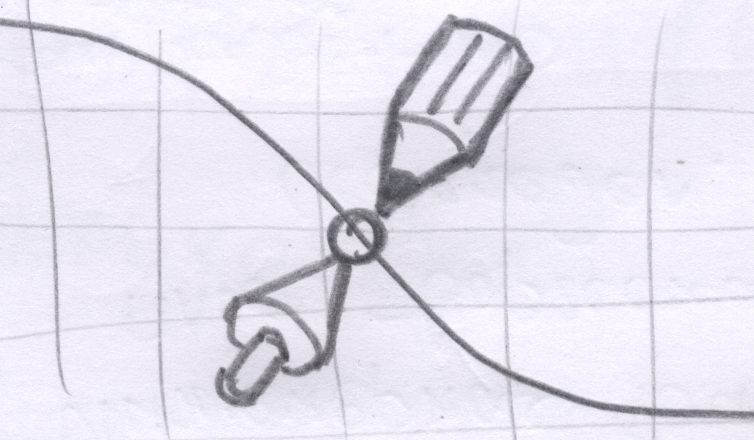

# Точка сборки - 3D

## Система создания 3D стерео презентаций

**"Точка сборки - 3D"** - cистема для создания 3D стерео презентаций. 

 

Система полезна для создания уроков и презентаций в сферах

- 3D-моделирование
- Черчение, начертательная геометрия
- Математика, геометрия, стереометрия, физика
- Молекулярная химия и биоинженерия
- Анимированные 3D- графики, визуализация данных, BI-презентации
- Разработка в области VR и AR

Для создания презентаций используется открытое конструкторское ядро **OpenCascade**. 
Создание выполняется с помощью языка **Python 3**. 
Просматривать презентации можно как в самой среде разработке 
так и выкладывать в интернет (просмотрщик основан на **WebGL** библиотеке **Three.js**).  

<!--
Презентация может состоять из множества кадров. Между кадрами возможны анимационные переходы. 
--> 

Как при разработке, так и при просмотре поддерживаются различные **стереоскопические режимы**. 
Вы можете подключить компьютер к **3D телевизору**, **3D проектору** или **Очкам виртуальной реальности** 
и прямо в среде разработки или в браузере запустить презентацию в стерео-режиме. 
Если Вы владеете режимом Перекрестного взгляда - он тоже есть.

Для примера посмотрите слайды про построение фигуры Дао в объеме:
- [Слайд 01 Контур классического Дао]( https://headfire.github.io/crpoint/viewer/index.html?paper=dao&slide=slide_01_DaoClassic)
- [Слайд 02 Контур Дао с отступом ]( https://headfire.github.io/crpoint/viewer/index.html?paper=dao&slide=slide_02_DaoConcept)
- [Слайд 03 Принцип построения сечений ]( https://headfire.github.io/crpoint/viewer/index.html?paper=dao&slide=slide_03_DaoSecPrincipe)
- [Слайд 04 Форма Дао из сечений ]( https://headfire.github.io/crpoint/viewer/index.html?paper=dao&slide=slide_04_DaoManySec)
- [Слайд 05 Протягивание поверхности через сечения ]( https://headfire.github.io/crpoint/viewer/index.html?paper=dao&slide=slide_05_DaoSkinning)
- [Слайд 06 Окончательная форма Дао ]( https://headfire.github.io/crpoint/viewer/index.html?paper=dao&slide=slide_06_DaoComplete)
- [Слайд 07 Форма Дао с основанием ]( https://headfire.github.io/crpoint/viewer/index.html?paper=dao&slide=slide_07_DaoWithCase)

STL файлы Дао 
- [Инь]( https://headfire.github.io/crpoint/viewer/slides/dao/slide_07_DaoWithCase/exp_001_shape.stl)
- [Янь]( https://headfire.github.io/crpoint/viewer/slides/dao/slide_07_DaoWithCase/exp_002_shape.stl)
- [Основание]( https://headfire.github.io/crpoint/viewer/slides/dao/slide_07_DaoWithCase/exp_003_shape.stl)

Не перепутайте Инь и Янь :) (отличий нет, но мало ли чего)

## Творчество без границ

Вам надоело возиться с глюками различных программ по 3D-моделированию? Вы чувствуйте, что визуальные инструменты 
ограничивают Ваши творческие возможности? Попробуйте мощное, надежное, свободное конструкторское ядро OpenCascade и с
овременный дружелюбный язык Python 3. Теперь Вы ограничены лишь своей фантазией!

Используйте систему "Точка сборки - 3D" для вывода Ваших идей и мыслей на новый презентационный уровень. 
Красочная стерео-презентация поможет Вам в любых начинаниях. 

## Узнать больше

[Установка среды разработки OpenCascade - Python 3.7 - Win64](docs/00_00_setup.md) 

<!--
[Библиотка Scene - базовая система команд](docs/00_01_scene.md)

[Начальные настройки слоев и стилей](docs/00_01_styles.md)

## Библиотека презентаций

[Web-просмотрщик - параметры URL-строки и действия в режиме просмотра](docs/00_03_viewer.md)
-->

## Контакты

Официальный сайт проекта [https://headfire.github.io/crpoint](https://headfire.github.io/crpoint)

Пишите про Ваши идеи и предложения на [headfire@yandex.ru](mailto:headfire@yandex.ru)
