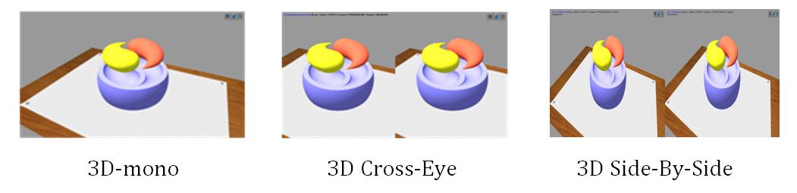

# Точка сборки - 3D

## Cистема для создания объемных стереоскопических иллюстраций   

Проект предназначен для создания объемных стереоскопических иллюстраций 
и презентационных материалов научной направленности:
- 3D-моделирование, черчение, начертательная геометрия
- Математика, геометрия, стереометрия, физика
- Молекулярная химия и биоинформатика
- Визуализация данных, BI-презентации, VR, AR

При просмотре презентационных материалов поддерживаются различные
3D режимы, которые работают прямо в браузере без каких-либо драйверов и утилит. 
Вы можете подключить компьютер напрямую (например, по HDMI интерфейсу) к
3D-телевизору, 3D-проектору или VR-шлему, поддерживающим режим 3D Side-By-Side.

В проекте использованы следующие технологии: 
- [OpenCascade](https://ru.wikipedia.org/wiki/Open_Cascade_Technology) - конструкторское ядро с открытым кодом,
используется для 3D-моделирования, геометрических построений, численного решения геометрических задач.
- [Python OCC](https://github.com/tpaviot/pythonocc-core) - надстройка над OpenCascade, позволяющее работать с ней 
при помощи языка Python.
- [Three.js](https://ru.wikipedia.org/wiki/Three.js) - JavaScript библиотека, позволяющая отображать
в браузере трехмерные сцены. Основана на технологии WebGL.
- А также [HTML](https://ru.wikipedia.org/wiki/HTML),
[CSS](https://ru.wikipedia.org/wiki/CSS),
[JavaScript](https://ru.wikipedia.org/wiki/JavaScript),
[WebGL](https://ru.wikipedia.org/wiki/WebGL),
[Python](https://ru.wikipedia.org/wiki/Python),
[Markdown](https://ru.wikipedia.org/wiki/Markdown),
[PDF](https://ru.wikipedia.org/wiki/Portable_Document_Format),
[QR-code](https://ru.wikipedia.org/wiki/QR-%D0%BA%D0%BE%D0%B4),
[STL](https://ru.wikipedia.org/wiki/STL_(%D1%84%D0%BE%D1%80%D0%BC%D0%B0%D1%82_%D1%84%D0%B0%D0%B9%D0%BB%D0%B0)),
[PNG](https://ru.wikipedia.org/wiki/PNG),
[Git](https://ru.wikipedia.org/wiki/Git),
[GitHub](https://ru.wikipedia.org/wiki/GitHub)

## Пример 1: Построение символа Дао в объеме

Статьи (PDF)
- [Построение символа Дао в 3D](https://headfire.github.io/p3/docs/dao_article.pdf)

Слайды (WebGL)
- [Слайд 01 Контур классического Дао](https://headfire.github.io/p3/v.htm?s=dao_01)
- [Слайд 02 Контур Дао с отступом](https://headfire.github.io/p3/v.htm?s=dao_02)
- [Слайд 03 Принцип построения сечений ](https://headfire.github.io/p3/v.htm?s=dao_03)
- [Слайд 04 Форма Дао из сечений](https://headfire.github.io/p3/v.htm?s=dao_04)
- [Слайд 05 Протягивание поверхности через сечения](https://headfire.github.io/p3/v.htm?s=dao_05)
- [Слайд 06 Окончательная форма Дао](https://headfire.github.io/p3/v.htm?s=dao_06)
- [Слайд 07 Форма Дао с основанием](https://headfire.github.io/p3/v.htm?s=dao_07)

Файлы моделей (STL) 
- [Инь]( https://headfire.github.io/p3/models/dao/exp_001_shape.stl)
- [Янь]( https://headfire.github.io/p3/models/dao/exp_002_shape.stl)
- [Основание]( https://headfire.github.io/p3/models/dao/exp_003_shape.stl)

Не перепутайте Инь и Янь :) (отличий нет, но мало ли чего)

## Для разработчиков

[Установка среды разработки OpenCascade - Python 3.7 - Win64](docs/setup.pdf) 

## Контакты

Cайт проекта: [https://headfire.github.io/point](https://headfire.github.io/point)  
Репозиторий проекта: [https://github.com/headfire/point](https://github.com/headfire/point)  
E-mail автора: [headfire@yandex.ru](mailto:headfire@yandex.ru)

Спонсор проекта: - - - - -

## Путь

*Как проповедь ни хороша*  
*Я б все же предпочел*  
*Чтоб объяснивший верный путь*  
*Со мной тот путь прошел*  

*Пусть что угодно говорят*  
*Хочу я видеть как*  
*Рука творит, а не слова*  
*Слетают с языка*

