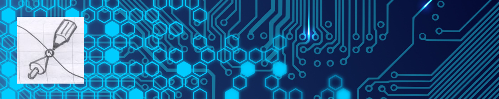

## Творческая мастерская "Точка сборки-3D" 
 
>*Творческая мастерская "Точка сборки-3D" - это особо прочный сплав из вдохновения, хаоса и конструкторской точности*

Результатом работы мастерской "Точка сборки - 3D" являются сувенирные, презентационные, конструкторские
и научные материалы, созданные с применением трехмерного моделирования: STL-модели, DXF-чертежи и развертки, 
инструкции в формате MD и PDF, ссылки на видео YouTube, также самое интересное - 
трехмерные интерактивные стерео-слайды

[Перейти на сайт проекта](https://headfire.github.io/p3)

---

*Как проповедь ни хороша*  
*Я б все же предпочел,*  
*Чтоб объяснивший верный путь*  
*Со мной тот путь прошел.*  

*Пусть что угодно говорят,*  
*Хочу я видеть как*  
*Рука творит, а не слова*  
*Слетают с языка.*

