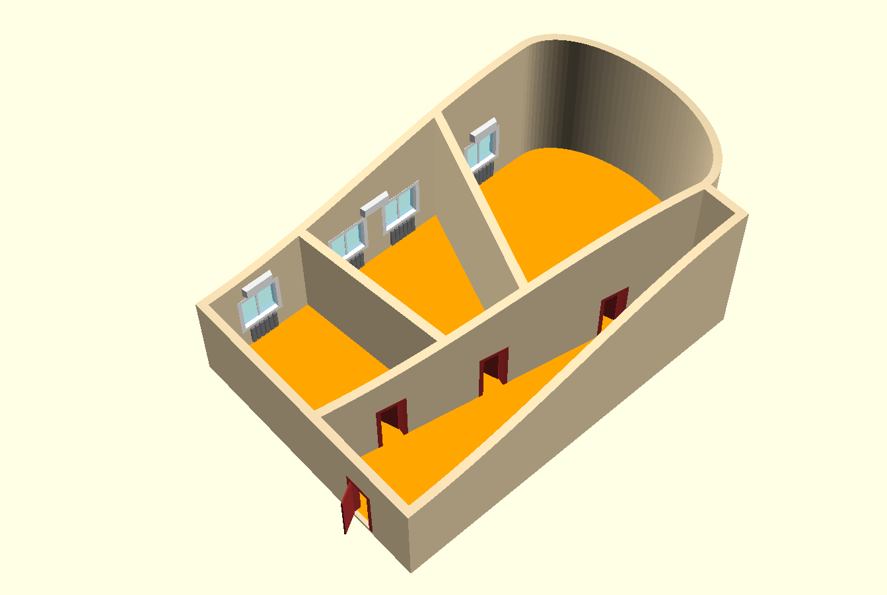
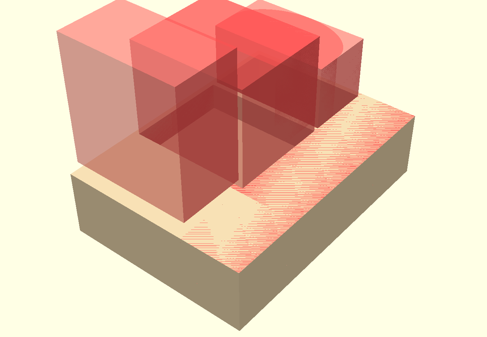
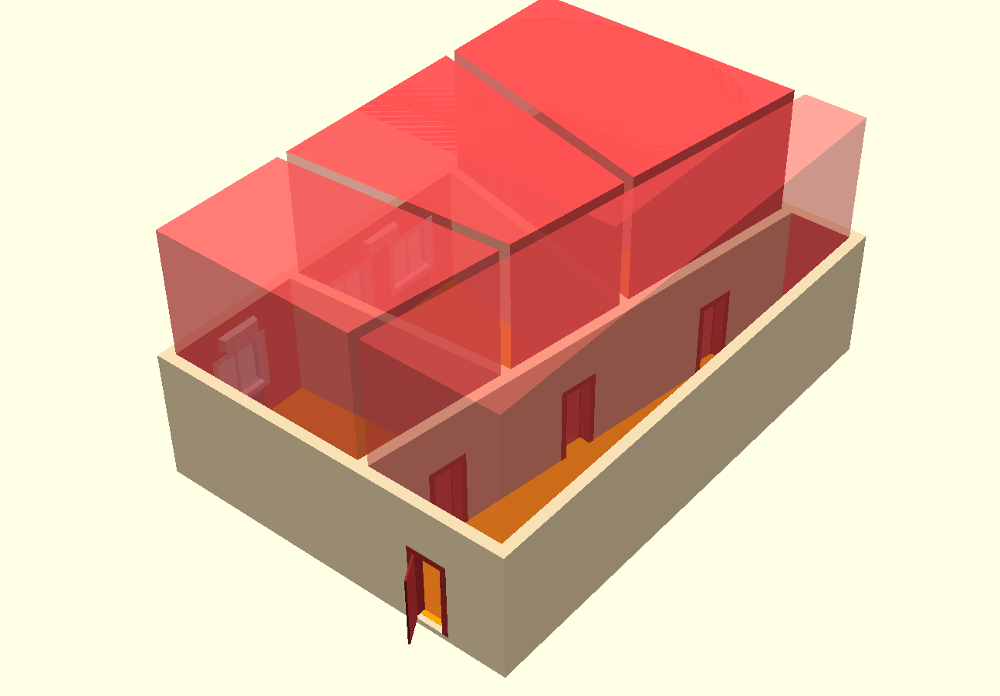
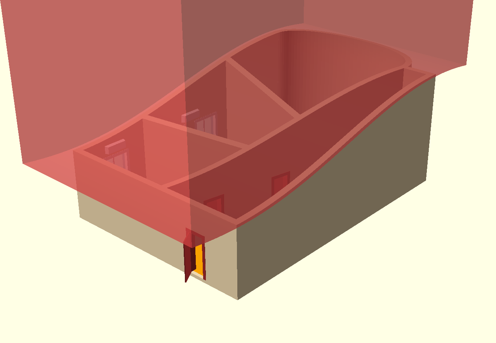
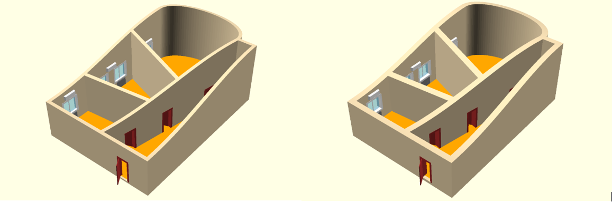

# Параметрическое моделирование. Трюк, которого не было



Привет, Хабр! У офисных центров есть такой вид услуг - проектирование и
подготовка офиса, специально под требования арендатора. Мне пришлось как-то
участвовать в подобной деятельности. И однажды в голове сложился некий 
сценарий рекламы офисных помещений. 
Я понял, что просто так от этой навязчивой идеи мне не избавится. 
Для быстрого прототипирования моих 3D-фантазий я использую OpenSCAD. 
Остальные инструменты не дотягивают до требуемого уровня безумства...
 

****

Чтобы было понятно о чем идет речь предлагаю посмотреть концепт-видеоролик.
Это черновик, который только показывает идею, поэтому прошу прощения за 
качество.
 
[Концепт-видео (YouTube)](https://youtu.be/nTueqlaXfzI)

Я не буду касаться очевидных вещей, типа дверных проемов, окон, элементов интерьера,
хотя там тоже были довольно любопытные вычисления. 
В этом видео есть несколько трюков, которые один за другим появляются на сцене
вызывая эффект неожиданности. И про них я хотел бы немного рассказать.

## Немного о структуре кода

Требуемая анимация должна состоять из нескольких сцен. Это для OpenSCAD 
не совсем типичная задача, поэтому потребуются некоторые подготовительные 
действия. Весь анимационный диапазон нужно разбить на сцены.
В каждой сцене анимировать нужные параметры. Ну и затем 
уже непосредственно отрисовать параметризованную модель.
Фактически мы должны повторить механизм ключевых кадров (keyframes),
применяемых в более профессиональных программах анимации. К счастью,
это не так сложно, как может показаться. Если посмотреть на код, то можно
увидеть, что даже сглаживание анимации с помощью кривой (здесь
применена синусоида) - в общем-то несложная задача.

```
function spline(x,x1,x2,y1,y2) = y1+((1+sin(-90+180*(x-x1)/(x2-x1)))/2)*(y2-y1);   

// анимация числового параметра
function fkey(time,keyframes)= 
  [ if (time<keyframes[0][0])
       keyframes[0][1]
    else if (time>=keyframes[len(keyframes)-1][0])
       keyframes[len(keyframes)-1][1]
    else
      for (i=[0:len(keyframes)-2])  
         if ((time>=keyframes[i][0])
             &&(time<=keyframes[i+1][0])) 
                spline(time, keyframes[i][0],keyframes[i+1][0],keyframes[i][1],keyframes[i+1][1])
  ][0];
  
// анимация логического параметра  
function bkey(time,keyframes)= 
  [ if (time<keyframes[0]+sigma)
       false
    else if (time>=keyframes[len(keyframes)-1]+sigma)
       isOdd(len(keyframes))
    else 
      for (i=[0:len(keyframes)-2])  
         if ((time>=keyframes[i]+sigma)
             &&(time<keyframes[i+1]+sigma)) 
              isOdd(i+1)
  ][0];

```

Теперь можно перейти непосредственно к разного рода хитростям, применяемым
в данном проекте.


## Трюк 1. Выдавливание офисных помещений



Сначала появляется простой параллелепипед, в котором выдавливаются будущие помещения.
На приведенном рисунке видно, как это работает. С помощью специальных вычислений
заготовлены "ножи", которые выгрызают из заготовки пустоты нужной формы.

```
if (isOffice)
  color("Wheat")
   difference() {
     outerOffice();        
     roof();
     translate([0,0,hRoom1])        
       room1();   
     translate([0,0,hRoom2])        
       room2(); 
     translate([0,0,hRoom3])        
       room3(); 
     translate([0,0,hHall])        
        hall();         
     if (isDoorHoles) {
        doorHoles(); 
     }
     if (isWindowHoles) {
        windowHoles(); 
     }
   }
```

## Трюк 2. Изменение углов внутренних стен



Как оказывается в дальнейшем - ножи непростые - они могут изменять форму. Одновременно с этим 
изменяется и форма выгрызаемых ими помещений.

```
module room1Room2Cat() {
   translate([xRoom1,0,0])    
     rotate(-90-alfa)
      translate([-catSize,-w,-hBase*0.2])    
       cube([catSize*2,catSize*2,hBase*3]);        
}

module room2Room1Cat() {
   translate([xRoom1,0,0])    
     rotate(90-alfa)
      translate([-catSize,-w,-hBase*0.2])    
       cube([catSize*2,catSize*2,hBase*3]);        
}

module room2Room3Cat() {
   translate([xRoom1+xRoom2,0,0])    
     rotate(-90+beta)
      translate([-catSize,-w,-hBase*0.2])    
       cube([catSize*2,catSize*2,hBase*3]);        
}

module room3Room2Cat() {
   translate([xRoom1+xRoom2,0,0])    
     rotate(90+beta)
      translate([-catSize,-w,-hBase*0.2])    
       cube([catSize*2,catSize*2,hBase*3]);        
}
```

## Трюк 3. Появление овального кабинета


За появление овального кабинета отвечают пара специальных объектов - один формирует внешний контур,
другой формирует внутренний. Эти объекты геометрически складываются и вычитаются с основными объектами
сцены, что формирует овальную стену. Объекты постепенно движутся изнутри наружу, что порождает эффект
анимированного выдавливания.

```
module oval(ww,hh) {
    translate([deltaOval,(yRooms+yRoomsDelta)/2,0])
    linear_extrude(hh)
    union() {  
      offset(ww)
        scale([xOval*2/(yRooms+yRoomsDelta),1,1]) 
           circle((yRooms+yRoomsDelta)/2,$fn=100); 
    translate([xOval,0])
      square([xOval*2,(yRooms+yRoomsDelta)+ww*2],true);  
    }    
}

module outerOffice() {
    union() {
       translate([-w,-w,-w])  
         cube([xRoom1+xRoom2+xRoom3+w*2,yRooms+yHall+w*2, hBase*3+w]);
       translate([0,0,-w])  
         oval(w,hBase*2); 
    }    
}

module innerOffice() {
 union() {   
   translate([w,w,0])
     cube([xRoom1+xRoom2+xRoom3-w*2,yRooms+yHall-w*2,hBase*2],false);
 oval(-w,hBase*2);    
 }    
}

```

## Трюк 4. Потолок в форме синусоиды



Это тоже интересный эффект. Оказывается, сверху все это время параллелепипед ограничивался
специальным ножом, который мог быть выше, ниже, а мог и вообще принимать форму синусоиды с 
произвольным размахом. В нужный момент все это активируется и меняет форму потолка.

```
function roof(x)=hBase+(hDelta2+hDelta1)/2
   +(hDelta1-hDelta2)/2*sin(-90+180*(x/(xRoom1+xRoom2+xRoom3)));
```
```
module roof() {
    xbegin = -xOval-w*2;
    xend = xRoom1+xRoom2+xRoom3+xOval+w*2;     
    xstep = 100;    
    coords = [[xbegin,catSize], 
               for (x=[xbegin:xstep:xend]) [x, roof(x)],
                [xend,catSize]];
    translate([0,yRooms+yHall+w*2,0])   
      rotate([90,0,0])
        linear_extrude(yRooms+yHall+w*4)     
           polygon(coords);
}
```

## Трюк, которого не было



Ну и наконец - трюк которого не было. В том смысле, что он не планировался. Просто при 
вычислениях я использовал параметр - толщина стен. Когда готовил окончательный вид сцен
решил подобрать оптимальную толщину. А потом возникла мысль - ведь этот параметр можно
анимировать. Всего одна строка кода - и эффект готов.

```
w = fkey(time,[[scWallPlus,150*gs],[scWallPlus+full,250*gs]]);
```

## Заключение

Как вы понимаете, вся эта статья - про силу и красоту параметрического 3D-моделирования.
Даже самые сложные эффекты в параметрическом моделировании можно реализовать шутя,
просто меняя параметр, используемый для вычислений. 

По данной концепции был сделан более профессиональный ролик

[Окончательное видео (YouTube)](https://youtu.be/v7JT4rnEYXI)

Конечно, он выглядит гораздо более презентабельно.
Но согласитесь - параметрический шарм исчез без всякой надежды
на возвращение. Наверное мои 3D-фантазии всегда останутся
в виде OpenSCAD-черновиков. Но я не жалуюсь - OpenSCAD - отличный
надежный инструмент. По крайней мере то, что он делает - 
он делает на отлично. 

Код проекта в виде *.scad-файла доступен по ссылке 
на GitHub

[Параметрическая модель (SCAD)](https://headfire.github.io/p3/projects/dream/dream.scad)


