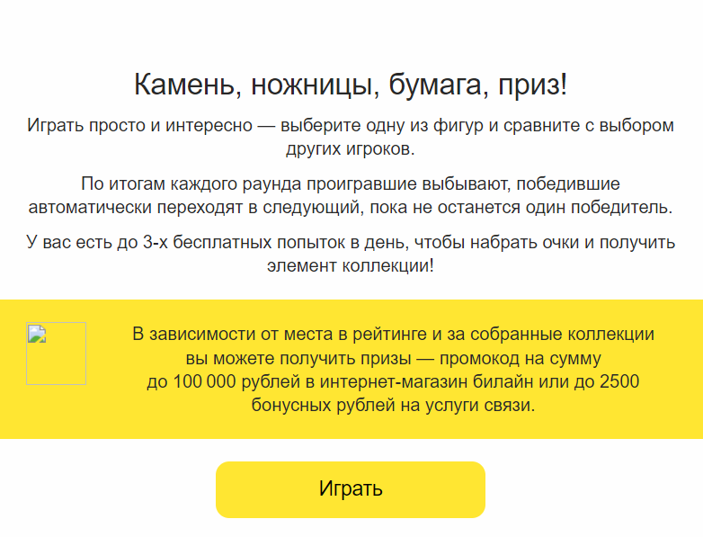

# Рефакторинг

Привет, Хабр! Последнее время очень много статей про выгорание, депрессии и
возможно психические заболевания среди программистов. Мне ВСЕ это знакомо
и я решил написать статью.

Я решил написать, потому что вижу, что многие авторы рассматривают проблему
поверхностно, сосредотачиваясь на симптомах. Это тоже важно. Но иногда 
хочется заглянуть немного глубже и попытаться вскрыть более фундаментальные
причины происходящего.

Жизнь человека во всей ее полноте, со всеми внутренними и внешними связями,
является сложной системой. Программисты каждый день на работе создают,
поддерживают, улучшают и развивают сложные системы. Они знают как это
делать. Все что требуется - направить эти знания непосредственно на
свою жизнь.

Я уверен, что многие программисты именно так и поступают. Возможно сами этого 
до конца не осознавая, применяют к жизненным ситуациям те же самые приемы,
что и к программному коду. Положительный эффект от этого может быть 
многократно усилен, если делать это вполне осознанно и на системном уровне.

Чем отличается тимлид од джуна? Думаю, что дело во многом не в знаниях языков
и приемов программирования. Джун плохо ориентируется в системе, он вносит
правки осторожно, боясь случайно разрушить то, что не понимает.
Тимлид знает систему настолько хорошо, что не боится в случае чего провести
глубокий рефакторинг, включая смену архитектуры, фреймворка, языка и экосистемы.

Мы все рождаемся неопытными джунами, и долгое время плывем по течению - жизнь с нами
просто случается. Постепенно решая практические задачи, которые нам ставит жизнь,
мы обретаем силу и понимание происходящих процессов. И в один момент мы чувствуем, 
что в состоянии провести глубокую перестройку нашей жизненной структуры.

# Основная психологическая проблема

Однажды я в одной книге прочитал фразу которая мне очень понравилась. Автор пишет:

> В 9 часов утра все дураки мира собираются на совещания и думают, как сделать
мою жизнь еще сложнее.

До некоторых пор я относился к этой фразе как к удачной шутке и прикольной метафоре.
Но в связи с тем, что сейчас творится вокруг, я понял, что эту фразу нужно воспринимать
как можно более буквально.

Окружающая среда создает для человека все новые и новые проблемы. Человек находится в постоянном
психологическом напряжении, ожидая подвоха с любой стороны: работодателя, продавца в магазине,
какого-то нового закона. В договорах мелким шрифтом написано, что практически все
условия могут быть пересмотрены. Человек постоянно ожидает удара в спину. Возможно люди попроще
могут с этим всем жить, а возможно во всем этом и участвовать. Но программист, обладающий высоким 
интеллектом и глубоким уровнем рефлексии, которые ему нужны для работы, может с этим и не справится.

Основная психологическая проблема в том, как ко всему этому относится. 
Все это надо воспринимать как внешние условия задачи. Математику глупо
обижаться, на то, что в дифференциальном уравнении возникли какие-то странные краевые условия.
Так же и мы не должны тратить на все это драгоценный запас эмоций, а зафиксировать как внешние
входные данные для наших жизненных алгоритмов.

# Динамические системы и инварианты

Наша жизнь не стоит на месте. Все постоянно меняется. Это было подмечено еще две тысячи лет назад,
когда один мудрец сказал, что нельзя войти дважды в одну и ту же реку. На это другой мудрец, еще
более разочарованный в жизни, сказал, что в одну и ту же реку нельзя зайти и однажды. Довольные
полученными результатами они разошлись и стали обдумывать другие не менее важные вопросы.

Изменчивость свойственна природе. Мы постоянно видим, как сталкиваются галактики, взрываются
сверхновые, невидимые черные дыры постоянно строят различные козни, темная материя тоже
не дремлет. Каждый, даже самый мелкий квант во Вселенной хаотически мечется в поисках занять
наиболее выгодный энергетический уровень. 

Не отстает от этого и человеческое общество. Только если в случае природы - это воздействие 
первозданного хаоса, то в случае с обществом - это сознательная целенаправленная деятельность. 
У человека постоянно выбивают почву из-под ног, чтобы он не смог твердо стоять или идти
в нужную ему сторону с комфортной для него скоростью. Мутный поток неотвратимых событий 
сбивает всех без разбору в общую кучу и с огромной скоростью увлекает в никому 
не ведомом направлении.

Сущности, непостоянные во времени, в науке называются динамическими системами. Вопрос: как
изучать систему, если она постоянно меняется. Ответ прост - нужно искать в системе то, что 
неизменно и исходя из того, что мы найдем, строить какие-то рассуждения. Характеристики
динамических систем, которые не меняются во времени, или меняются достаточно медленно, или
меняются только при каких-то существенных условиях называются инвариантами. 

Поиск инвариантов - основная задача науки, и вообще любой разумной деятельности. 
Зная инварианты системы мы можем многое сказать о ее поведении. Мы научимся предсказывать 
и даже синтезировать системы с нужными динамическими
характеристиками. Как правило, за каждым инвариантом (но не всегда) - скрывается какая-либо
физическая, психологическая или юридическая реальность. Любая физическая константа, формула
или закон в явном или неявном виде отражает инвариант.

Все трейдеры на бирже мечтают обнаружить некий инвариант, скрытый от других. Опираясь
на него они могут делать предсказания, неочевидные для всех остальных. Вот например - свободное 
обращение криптовалют - инвариантом не является, так как в любой момент
оно может быть ограничено законом. А вот постоянное желание государства контролировать финансовую 
сферу - можно считать инвариантом и уже строить на нем какие-то рассуждения. 

Вы уже поняли к чему я клоню. Любую деятельность по организации своей жизни нужно строить
на инвариантах - на том, что изменится не может, по крайней мере в обозримой перспективе.
Это не бог весть какое откровение. Об этом говорится в мудром совете мудрого человека - не строить
свой дом на песке, а строить на камне. Проблема только в том, что со всех сторон заботливые
люди самосвалами свозят песок, и мы очутились в пустыне, без каких либо заметных каменных 
конструкций.

# Небольшой пример

Вы можете думать, что я сгущаю краски и вообще ворчун.
Я не собирался писать этот раздел, но сама жизнь мне подсказала тему.
Когда я дописывал предыдущий абзац у меня булькнул телефон. Я не выдумываю, так все
и было. Думая что это от друзей, или что ответ на мой комментарий на Хабре, я открываю
телефон и вижу:

Зачем билайну магазин? Что там можно купить на 100 000 руб?
Почему я для этого должен играть в азартную игру? И вообще 
почему они решили, что имеют право посылать мне такое письмо?
Какое это все имеет отношение к передаче голоса на расстояние?

Конечно, обладая аналитическими способностями можно примерно восстановить
реальное содержание сообщения (по-моему что-то было у Пелевина по поводу
этого искусства)

> Здравствуйте! Это ваш Билайн. Вы уже более 20 лет являетесь нашим клиентом.
> Мы это очень ценим и поэтому хотим Вас предупредить. Сообщаем, что так как 
> у нас сейчас нет доступа
> к новым технологиям, услуги связи будут постепенно ухудшаться, а их стоимость
> расти. Чтобы вы не сильно расстраивались предлагаем вам потратить 
> кучу вашего бесценного времени на игру, в которой собственно от вас ничего 
> не зависит. Это все придумал наш самый талантливый маркетолог, кроме того
> наши самые лучшие программисты, которых мы сняли с задач биллинга, роуминга,
> и качества связи, так как сейчас это совсем не важно. 

> Мы послали это письмо
> потому что наш сайт постоянно совершенствуется и сами Вы на нем ничего найти
> не сможете. Он теперь основан на полностью динамических компонентах. Цель этой
> технологии - не дать поисковикам проиндексировать информацию о тарифах,
> которая непредсказуемым образом меняется в пространстве и времени.

Эх, отвел душу... 

# Cходимость и устойчивость

Одной их самых важных свойств динамических систем является их устойчивость. 
Как правило, динамические системы описываются дифференциальными уравнениями. В таких 
случаях говорят о сходимости уравнений. В этом случае система развивается 
по устойчивым траекториям. И даже сильные внешние воздействия не вызывают
катастрофических последствий и система возвращается на свою траекторию.

Если мы рассматриваем нашу жизнь, как динамическую систему, то всем нам хочется,
чтобы у этой системы было предсказуемое и устойчивое поведение. Если мы хотим 
изменить нашу жизнь к лучшему, мы должны действовать таким образом, чтобы 
не нарушить устойчивость системы ни во время изменений, ни после.

Проблема в том, что психические и физические силы человека ограничены. На
самом деле он может держать под контролем очень ограниченный слой реальности.
Сама потребность изменить жизнь, часто связана с осознанием, что по-прежнему
нам уже не справиться с вновь возникающими внешними условиями. Проблемы растут
как снежный ком. Старая система идет вразнос. И надо что-то делать. 
В народе про такое говорят: семь бед - один ответ.

# Грамотный рефакторинг

При написании программного кода тоже возникает такая ситуация. Ее называют
технический долг. Система перестает справляться с вновь и вновь поступающими
функциональными требованиями. Внесение исправлений порождает каскад ошибок.

Важно вовремя остановится и понять, что происходит не так. И начать постепенный
рефакторинг. Все методы, которые применяются к программному коду - применимы 
и к жизненным ситуациям.

- Разбивать сложные задачи на простые
- Действовать короткими шагами-коммитами-транзакциями
- Там где надо уменьшать связность, где надо - увеличивать
- Изолировать легаси 
- То что больше всего напрягает - огораживать защитным кодом
- Инвертировать зависимости
- и т.д.

Но все эти действия могут не привести к цели без одного условия - наш код
должен все ближе и ближе отражать суть моделируемых и контролируемых событий. 
Без этого мы не обеспечим сходимость процесса. С каждым шагом жить должно становится 
все легче и легче. Если этого не происходит, если мы постоянно пишем и переписываем одно и то же
значит наш код, каким красивым бы он не был - удаляется от реального положения вещей 
и не отражает их смысла.

И в следующем разделе я хочу поговорить о сути и смысле вещей.

# Ближе к сути

Успех того или иного мероприятия, начинания, изобретения зависит от того, насколько
близко удается с помощью этого приблизится к сути происходящих процессов. 

Проблема в том, что суть не объяснить. Как говорили мудрецы прошлого - 
"Не описать словами истинное Дао". Постигнуть суть можно только постепенно 
приближаясь к ней с помощью какой-либо практики. Возникает парадокс - 
успех практики зависит от приближения к сути.
А сама суть постигается при какой-либо практической деятельности. 

В этом вся сложность и есть.

Вот например, на Хабре каждый месяц кто-то выдумывает свой язык программирования.
Я уже писал, что всячески поддерживаю написание велосипедов, и прочие рискованные
эксперименты. Но в некоторых случаях сразу видно, что ничего не получится.

Один человек решил отказаться от ключевых слов и заменил их скобками. Потом
правда одумался, ввел механизм макросов, с помощью которого ввернул ключевые слова обратно.
Там правда заявлены еще некоторые тензорные вычисления, но думаю это тоже ситуацию не спасет.
Другой вообще честно заявил, что не знает что за язык будет и начал с самого понятного - 
лексического анализатора. Третий решил из всех программистов сделать конечные автоматы.
Основным преимуществом, как он сам заявил, является то что программа получается
в пятьдесят раз длиннее.

Почему здесь сомнения? Язык будет успешным, только если станет ближе по сути к некоему типу
вычислений и описываемой реальности. А стать ближе к сути заменой ключевых слов на скобки 
не получится. Сделать это можно только с введением новой парадигмы, или с очень 
катастрофически удачного сочетания старых парадигм. То же самое можно сказать 
и о различных библиотеках и фреймворках, так как
это тоже своего рода создание новых языков, только в рамках базового языка.

Приведу еще пример. Один ученый, по-моему Лейбниц, окрыленный успехами математики,
решил придумать для людей язык, на котором они могли бы говорить. Основным
свойством этого языка было то, что на нем нельзя было врать и вводить друг 
друга в заблуждение. Предполагалось, что после повсеместного введения данного
языка в мире наступит благоденствие и процветание. Конечно, это не взлетело.
Язык оказался далек от сути человека. Человек неоднозначен, часто сам не знает чего
хочет. Кроме того, ему нужно как-то выживать в конкурентной среде.

Или например. Некоторые силы в мире всяческими способами ограничивают и хотят 
запретить наличные платежи. После этого, в соответствии с неумолимой логикой развития
финансовой сферы, будет введен отрицательный процент по вкладам. Но я думаю мы
можем пока жить спокойно. Понятно, что у рептилоидов ничего не получится.
Потому что суть денег в том, что человек приобретает на них развлечения и удовольствия.
А так как за наличный расчет можно приобрести гораздо больше разных 
удовольствий, то наличная форма расчета никуда не денется.

# Еще ближе к сути

# Полное проникновение в суть

Мы должны приблизится как можно ближе к сути, но совсем, без охранного зазора, проникать
в суть вещей опасно.

Вот например, йоги. Это дружелюбные, приятные в общении, трудолюбивые, 
здоровые люди с очень хорошей логикой и разумными суждениями. Но никогда не надо
забывать, что основная цель йога - самадхи.
Считается, что в этом состоянии йог постигает истину и проникает в суть вещей. 
И вот когда йог достигает самадхи - он сидит неподвижно, уставившись в одну точку. 
Йоги низших ступеней входят в самадхи на время. Более продвинутые - навсегда.
И все мирское их уже не интересует.

Мы должны подобно Икару, взлететь как можно выше и приблизится к солнцу истины,
но все-таки держаться на некотором расстоянии, чтобы не упасть с опаленными крыльями
не в силах оправится от этого всепроникающего огня.

# Про тайм-менеджмент и прочие выходы из зоны комфорта

Я с интересом читаю различные статьи на тему повышения эффективности, тайм-менеджмента,
постановки различных целей, выработки привычек и прочих интересных принципов, которыми
люди почему-то хотят поделиться с миром. Хотя казалось-бы - у тебя в руках золотое дно - 
применяй это в своей жизни, купайся в золоте, и никому особо про это не рассказывай.
Как пелось в известной песне: 

Страна лимония - страна без забот,
в страну лимонию ведет подземный ход,
но я тебе не дам - и не смей меня винить.

Я все это читаю, для того, чтобы действовать в соответствии с древним принципом - 
послушай и сделай наоборот. Я не понимаю, зачем куда-то выходить из зоны комфорта и
заниматься тем, чем не нравится. Я не понимаю зачем мне ради каких-то целей менять свое окружение 
и расстаться с другом, с которым я пью пиво по средам вот уже 18 лет. 

Что касается времени, то здесь моя позиция однозначная - всячески старайтесь избегать событий
жестко привязанных ко времени. Современные люди распяты на своих расписаниях. Каждое событие
запланированное в календаре - еще один гвоздь в ваши руки и ноги. Старайтесь, чтобы вас оценивали
по результату, а не по проведенному где-то времени.

Представьте, что окружающее Вас пространство как дома, так и на улице на 90% заполнено
различными предметами, через которые едва можно протиснуться. Мы понимаем, что для пространства
это абсурд. Но с легкостью допускаем это для времени. Почему наше время на 90% должно быть
забито неотложными делами? Как мы можем эффективно действовать не имея возможности для
маневра.

В книгах Кастанеды среди различных спорных концепций есть одна вполне здравая мысль - у охотника
не может быть расписания. Расписание может быть только у добычи.

# Эликсир

Но ведь как-то мы все равно должны менять нашу деятельность, чтобы повышать эффективность
и удовлетворенность жизнью.

Да. И тут нужно присмотреться, чем мы занимаемся и что нам нравится в той или
иной деятельности. Речь больше идет не о физической сути деятельности, а о сопровождающих ее 
психических процессах. Соответственно мы должны увеличивать концентрацию деятельности, где
мы наиболее эффективны. А это, как правило, та деятельность, которая сопровождается приятными
для нас психическими процессами.

Вот например история, как изобрели инсулин. В какой-то момент люди заметили, что больным с
диабетом помогает сырая печень. Но чтобы эффект был заметен - требовалось съесть 5 кг 
сырой печени в день. И вот один ученый взялся и постепенно выделил чистый инсулин.
И теперь достаточно несколько грамм. Это довольно стандартная история. Почти все эффективные 
лекарства прошлого были получены выделением действующего вещества из растений и других живых организмов.

Часто мы в жизни хлебаем полной ложкой то, что нам предоставила судьба. Но давайте мы не будем 
бездумно жевать это сено, а будем выбирать из него травинки наиболее приятные на вкус. Давайте
эти травинки засунем в пресс и путем возгонки выделим эликсир - то что нам действительно
приносит долговременную радость.

# 
