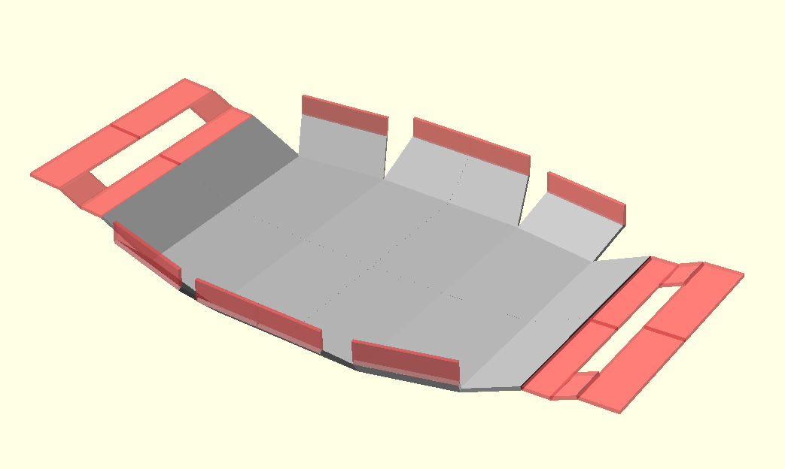
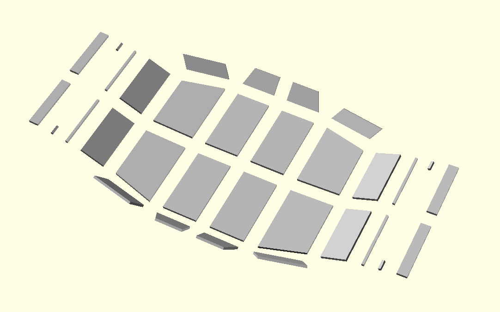
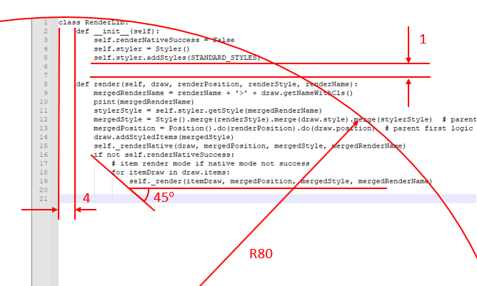

# Трюк, которого не было - 2

Привет, Хабр! Моя [прошлая статья](https://habr.com/ru/post/701360/) была встречена сообществом очень хорошо. В обсуждение зашел даже @kompass_3D, чем я
по-настоящему горжусь. Я решил написать небольшое продолжение.

Основной проблемой, поднимаемой в комментариях была полная бесполезность построенного 
мной объекта. Люди искренно пытались помочь, предлагали различные варианты... Но все тщетно. Результатом всех 
дискуссий стала абсолютная ясность, что пользы от этого чуть меньше чем никакой.

На этот раз я попробую реабилитироваться и построить что-то более пригодное. Хотя, если честно, здесь
тоже большие сомнения. Все, кому я это показывал, сначала долго смотрели в экран, потом долго смотрели на
меня, крутили пальцем у виска и отходили на безопасное расстояние...

***

## Сейф-пряжка на ремень

Однажды я ехал в поезде, полном народу с довольно большой суммой наличных денег. Ночью хотелось поспать,
но сердце было не на месте - вдруг с деньгами что-то случится. Результатом этой бессонной ночи и стала
эта странная конструкция.

Это металлический объект, напоминающий по форме пряжку. Он сделан путем гнутья из не очень толстой стали.
Размеры позволяют запихнуть в него кредитные карты, сложенные купюры, возможно сим-карты, и прочие мелкие, но важные 
вещи. К данному изделию прилагается плоская крышка. Она вставляется в пазы,  
попадает в выемки и защелкивается за счет естественной упругости. Когда сквозь проушины в эту конструкцию вдевается 
ремень, проникнуть внутрь защищаемого объема не представляется никакой возможности (разумеется, если каким-то образом
не повредить и не ослабить ремень). 

Конструкция скруглена по форме тела, кроме того обладает некоторой свободой - может
подстраиваться для наилучшего сидения на теле и на ремне. Если предполагается проходить сквозь болота, пустыни, пыльную
местность - защищаемые вещи могут быть упакованы в герметичный мешочек. На передней стороне может быть нанесена
некоторая гравировка, которая может перенести статус этого изделия в разряд мужских сувениров. Возможно эта вещь 
может понравиться различным неформалам, байкерам, музыкантам, путешественникам.

Вот наверное и все что можно сказать по функционалу объекта, и теперь можно перейти непосредственно к 
геометрическим построениям.

## Преимущества параметрического построения

Если объект из предыдущей статьи я вообще не представлял, как можно построить без программирования (с учетом
предполагаемой анимации), то данный объект вполне мог быть построен традиционными конструкторскими инструментами.
Но я конечно все-равно выбрал параметрическое построение в OpenScad.
- В основном, конечно, потому что мне это нравится. Как вы уже поняли я от всего этого тащусь
- Мне еще не до конца была ясна форма и размеры - ремни бывают разной ширины, оптимальная толщина должна с одной
  стороны обеспечивать нужный защищаемый объем, с другой стороны изделие не должно слишком выделятся и мешать, 
  ну и хотелось вообще подобрать благоприятные глазу форму и пропорции
- Стало очевидно, что чертить придется две формы - объект в разогнутом виде, 
  чтобы сделать развертку и изготовить прототип, и в полностью согнутом, чтобы проверить замыкание размеров
- Вследствие этого возникла идея - если ввести параметр согнутость от 0 до 1, то можно практически бесплатно получить
  и промежуточные состояния объекта и анимацию

Дальше я примерно опишу логику построений, и в русле общего названия статей буду называть это трюками, хотя конечно
это больше обычные решения, принимаемые при генерации различных геометрических форм.

## Трюк 1. Базовая трапеция

Примерно оценив геометрию, я понял, что всю конструкцию можно представить в виде сочетания трапеций, поэтому
практически сразу написал код генерирующий трапецию с необходимыми параметрами. Все остальное, что теперь придется 
делать - строить эти трапеции и нужным образом соединять. Этот шаг привел к некоторому эффекту, о котором я 
в последствии расскажу. 

Если отойти немного в философию программирования - 
когда вы выделяете некоторый объект - как прародитель всех остальных объектов - будьте готовы к различным
сюрпризам - как к приятным, так и не очень.

## Трюк 2. Симметрия

Еще одним очевидным свойством данного объекта является симметрия, как горизонтальная, так и вертикальная. Поэтому
мы смело можем строить только четверть объекта, а все остальное получить отражением. Этот вид мухлежа широко 
распространен в мире САПР.

Если бы портной делал только четверть костюма и пытался его продать как целый - его
бы конечно посадили в тюрьму на длительный срок. А у компьютерных проектировщиков это проходит на ура.

## Трюк 3. Обратная логика построений

Это решение неочевидно и идет в разрез с интуицией. Логично начинать строить с центральных элементов и заканчивать
краевыми. Но когда я так стал делать, пытаясь учесть сгибы - оказалось, что это все порождает очень большой
объем кода - и чем дальше отходишь от центральной базы - тем хуже. 

> Анекдот: работника попросили нанести краской разметку на проезжую часть. За первый день он разметил 500 метров дороги,
на второй день - 100 метров, на третий - всего 10. Когда начальник спросил почему падает выработка он ответил: Ну так
я все дальше и дальше от банки с краской ухожу.*

Когда, поступаешь наоборот, строишь снаружи к центру - вычисления становятся более естественными. 
Банка с краской становится к тебе ближе.

## Трюк, которого не было

Я уже завершил построения, полюбовался анимацией, поиграл различными размерами. Настала пора сделать развертку.
Мне не понравилось, что на развертке некоторые линии не прорисовались. Причина этого понятна - все эти синусы,
косинусы, повороты и прочие округления приводят к микронеточностям. На форму это абсолютно не влияет, но когда
геометрическому ядру надо принять решение - прорисовывать линию между объектами или нет, эти неточности уже
начинают сказываться. Я понял, что OpenSCADу нужно немного помочь и слегка развести края объектов на некую
ничтожную величину. Без всякой задней мысли я обозначил эту микро величину как параметр. 
Хищно оглядел код, думая, куда бы внести нужные инъекции. Мой взгляд вдруг упал на код базовых трапеций. 
Всего несколько точных вставок - и цель была достигнута - все нужные прямые прорисовались. Правда 
прорисовались и не совсем нужные, но кашу маслом не испортишь.

Но вот какое дело - в модели появился новый параметр. Хоть он носит и технический характер, но параметром
он быть не перестает. А значит им можно побаловаться. Я начал присваивать ему уже не микро, а вполне макро 
значения. 

На моих глазах моя пряжка начала эффектно, квазисимметрично и эквидистантно растворятся в воздухе. 
Эффект был очень красивый, и конечно при желании его можно анимировать. Вот уж точно не знаешь, где найдешь,
где потеряешь.

Надеюсь мне снова удалось вас немного развлечь. Код проекта доступен на GitHub

- [Параметрическая модель (SCAD)](https://headfire.github.io/p3/projects/safe/safe.scad)

## Некоторые мысли в заключение

Мне нравится программировать, особенно когда это связано с геометрическими построениями в объеме. На пересечении
трехмерной геометрии и программирования рождается некоторая своя красота и особое пространство смыслов. И конечно
я желаю всем конструкторам быть ближе к программированию, так как это может значительно облегчить их жизнь.
Но как было сказано в комментариях к предыдущей статье - требовать от конструкторов знания программирования
нелепо и антипродуктивно - у них и своих конструкторских проблем выше крыши, незачем им добавлять еще и
программистские, с которыми даже программисты еще не совсем научились справляться. Разрешить это противоречие
очень трудно. У меня есть некоторые мысли и я обязательно хочу об этом написать. 

Эту же статью я хочу закончить на несколько другой ноте: программистам тоже есть чему поучится у конструкторов.
Если бы меня спросили какой важный принцип нужно перенести из конструирования в программирование - я бы сказал
открытость, понятность и законченность конструкции. Конструирование - это игра в открытую. Все что хотел
сказать конструктор - присутствует на чертеже. У чертежа нет скрытых слоев, тайных закладок, то работающих,
то не работающих кэшей. Чертеж нельзя скомпилировать в какую-то непонятную ерунду, которая вроде работает,
но как - ни за что не понять. На чертеж нельзя сделать DDOS-атаку. Конечно, в конструкциях есть много смыслов и 
хитростей - но это все присутствует в максимально явном виде. Кстати, этот принцип перенял язык Питон - первым
делом в нем провозглашено - явное лучше неявного - и мы видим, что Питон сейчас один из самых успешных языков.

Я уже говорил, что мой отец - авиационный инженер. Несмотря на возраст, он старается идти в ногу со временем.
На его столе - вполне современный компьютер, которым он вполне хорошо пользуется. Но иногда он мне задает
вопросы, на которые я не могу ответить, а только краснею. Почему в каждой новой версии Windows все меняется
и ничего не найти на прежних местах. Почему файлы в папках отображаются по-разному и этим 
совершенно невозможно управлять. Почему в папке "Мои документы" документы лучше не
хранить. Почему, чтобы отправить письмо, нужно посмотреть тонну рекламы. Почему при
поиске ответа на достаточно определенный вопрос Интернет выдает 300 000 сайтов
с одинаковой информацией, которая одинаково бесполезна. Почему в Скайпе нет нормального списка контактов
и отовсюду лезут эмодзи, на которые нормальный человек не может смотреть без брезгливости.
И масса других вопросов, включая стандартные - почему 
все тормозит и глючит. Если вы читали книгу "Психбольница в руках у пациентов",
то вам станет примерно понятно содержание наших разговоров.

Хотя прямых ответов у меня нет, но у меня есть некоторые соображения на этот счет.

Какое-то время я работал на заводе. И однажды спросил у отца, почему в авиационном двигателе некоторые детали
делают на головном предприятии, а некоторые изготавливают в филиалах. По какому принципу делается разделение?
Наверное некоторые детали особо ответственные, а некоторые не очень. Он мне ответил без пафоса, как-то буднично,
без стремления донести какую-то сверх истину. Но эти слова сильно врезались мне в память. Он сказал: "Понимаешь,
Миша, в авиационном двигателе неответственных деталей не бывает."

Думаю, когда ИТ-индустрия будет также относится к тому, что она делает - все встанет на свои места.

