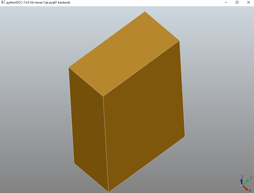

# Установка OpenCascade - Python 3.7 - Win64
 
## Устанавливаем среду Анаконда 3 (Python 3.7)

Путем экспериментов установлено что наиболее стабильно все работает на версии Python 3.7. Создаем среду с требуемой версией. Для нашей версии достаточно пакета "Миниконда".

- Скачиваем установщик: <https://repo.anaconda.com/miniconda/Miniconda3-py37_4.10.3-Windows-x86_64.exe>
- Выбираем опцию **All Users** и папку **d:\conda** (например).
- В списке программ кнопки Пуск появилось меню Anaconda3. Копируем из него ярлык Anaconda Prompt на рабочий стол

## **Устанавливаем библиотеки**

Для работы с OpenCASCADE нужны следующие библиотеки:

- Qt (графическая подсистема) 
- PythonOCC (OpenCascade for Python 3)

Оставаясь в командной строке conda набираем команды

```
conda install pyqt
conda install -c dlr-sc pythonocc-core
```

## **Скачивание и запуск примеров**

Устанавливаем Git. Загружаем и запускаем отсюда <https://git-scm.com/download/win>. Все настройки оставляем по умолчанию.

Клонируем репозиторий с примерами

```
c:
cd c:\projects
git clone https://github.com/tpaviot/pythonocc-demos.git
cd pythonocc-demos\examples
python core\_helloworld.py
```

Должно открыться окно с следующей картинкой



Это значит что среда настроена правильно.

Если ошибка – можно попробовать 

<https://github.com/tpaviot/pythonocc-core/issues/987>

```
Can you please open the file  
F:\zapoye\anaconda3\envs\pyocc\lib\site-packages\OCC\Display\qtDisplay.py,  
and change the line 38 

from:    
class qtBaseViewer(QtOpenGL.QGLWidget):
to:  
class qtBaseViewer(QtWidgets.QWidget):
```

Клонируем проект headfire/p3

c:
cd c:\projects
git clone https://github.com/headfire/p3.git
cd p3/projects/dao
python makeDaoShape.py

## **Полезные ссылки**
- <https://www.opencascade.com/>
- <https://www.opencascade.com/doc/occt-6.9.1/refman/html/index.html>
- <https://docs.conda.io/en/latest/miniconda.html>
- <https://github.com/tpaviot/pythonocc-core>
- <https://github.com/tpaviot/pythonocc-demos>
- <https://git-scm.com/download/win>


