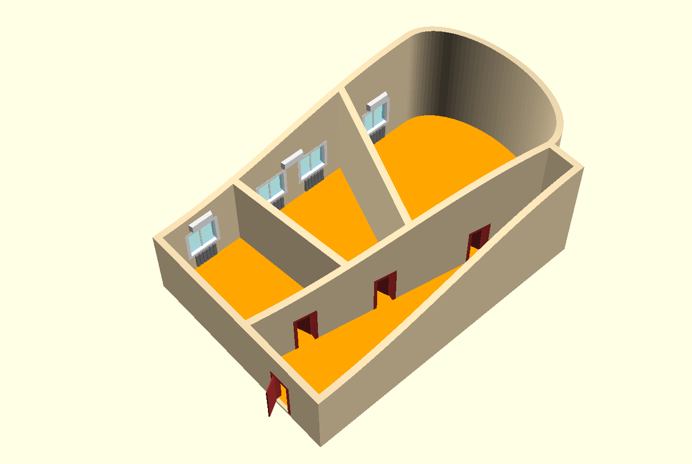
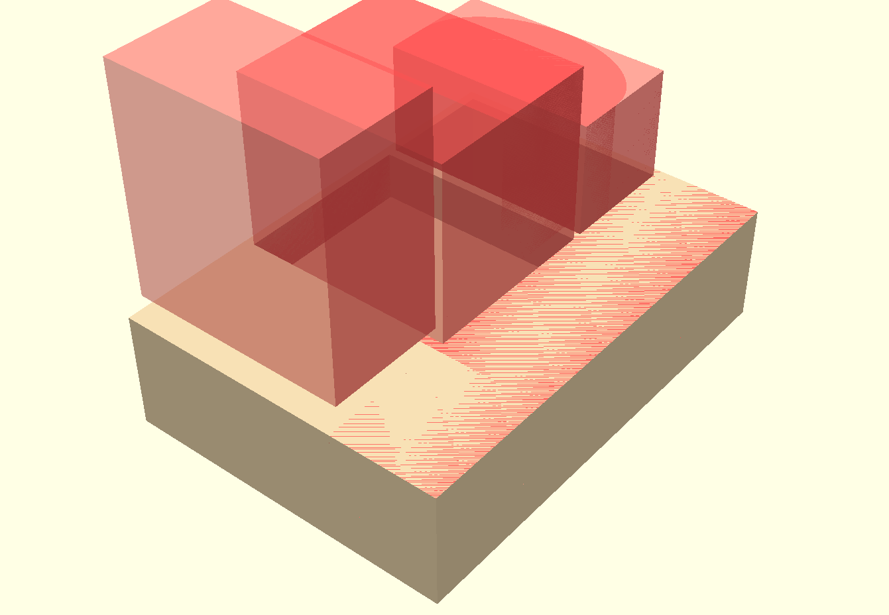
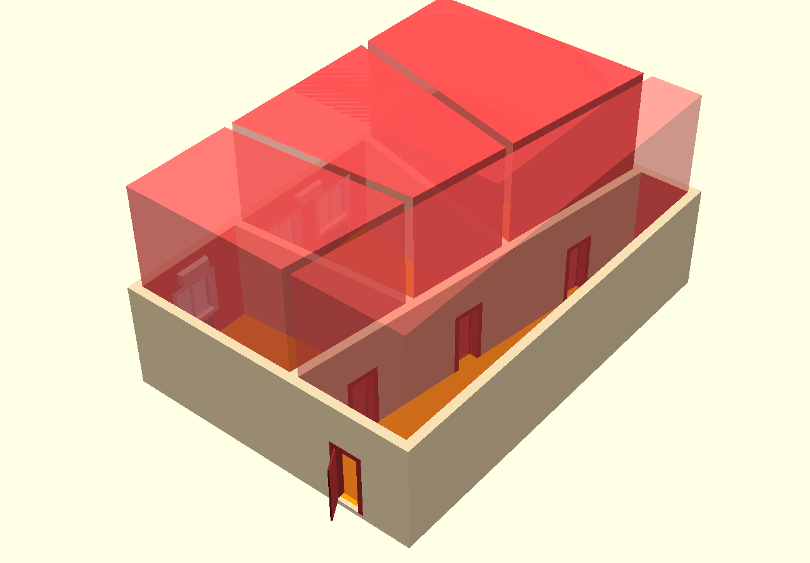
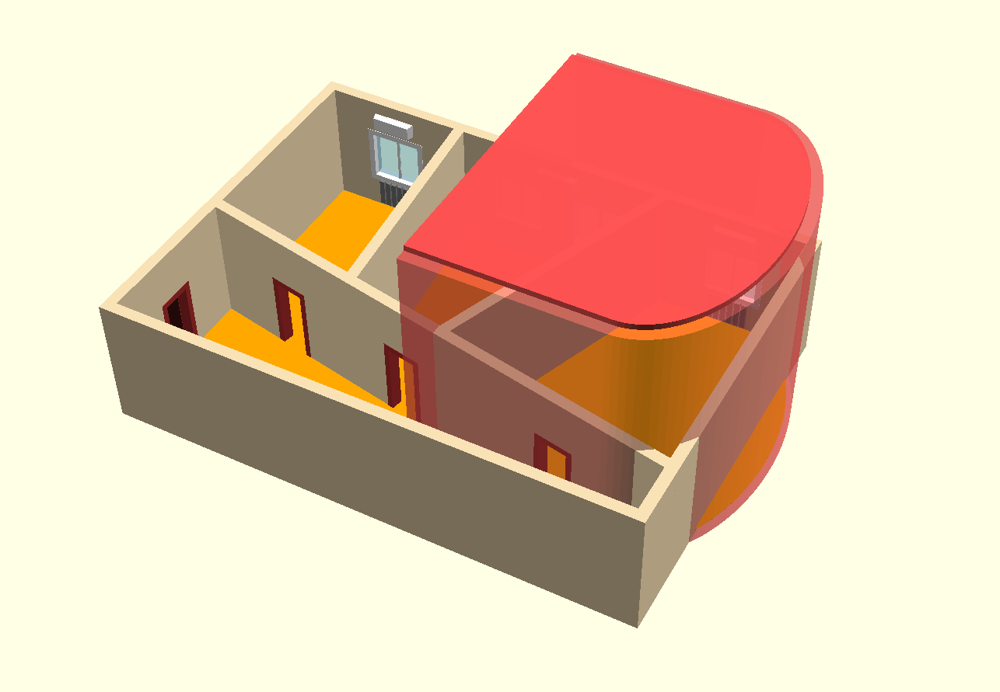
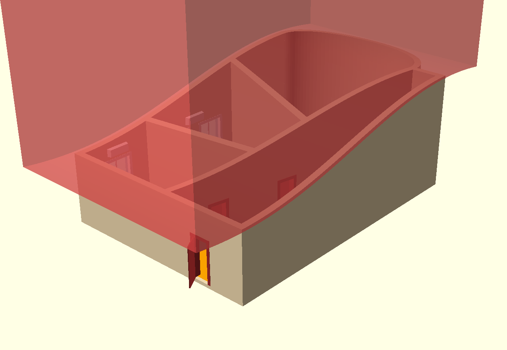
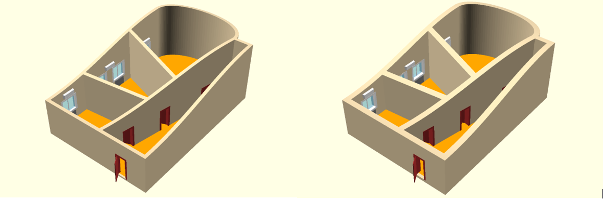

# Параметрическое моделирование. Трюк, которого не было

Привет, Хабр! У офисных центров есть такой вид услуг - проектирование и
подготовка офиса, специально под требования арендатора. Мне пришлось как-то
участвовать в подобной деятельности. B однажды в голове сложился некий 
сценарий рекламы офисных помещений. 
Я понял, что просто так от этой навязчивой идеи мне не избавится. 
Для быстрого прототипирования моих 3D-фантазий я использую OpenSCAD. 
Остальные инструменты не дотягивают по возможностям до творимых 
мной безумств... 
 

****

Чтобы было понятно о чем идет речь предлагаю посмотреть концепт-видеоролик.
Это черновик, который только показывает идею, поэтому прошу прощения за 
качество.
 
[Концепт-видео (YouTube)](https://youtu.be/nTueqlaXfzI)

Я не буду касаться очевидных вещей, типа дверных проемов, окон, элементов интерьера,
хотя там тоже были довольно любопытные вычисления. 
В этом видео есть несколько трюков, которые один за другим появляются на сцене
вызывая эффект неожиданности. И про них я хотел бы немного рассказать.

## Трюк 1. Выдавливание офисных помещений.

Сначала появляется простой параллелепипед, в котором выдавливаются будущие помещения.
На приведенном рисунке видно, как это работает. С помощью специальных вычислений
заготовлены "ножи", которые выгрызают из заготовки пустоты нужной формы.

## Трюк 2. Изменение углов внутренних стен.

Как оказывается в дальнейшем - ножи непростые - они могут изменять форму. Одновременно с этим 
изменяется и форма выгрызаемых ими помещений.

## Трюк 3. Появление овального кабинета.

За появление овального кабинета отвечают пара специальных объектов - один формирует внешний контур,
другой формирует внутренний. Эти объекты геометрически складываются и вычитаются с основными объектами
сцены, что формирует овальную стену. Объекты постепенно движутся изнутри наружу, что порождает эффект
анимированного выдавливания.

## Трюк 4. Потолок в форме синусоиды.

Это тоже интересный эффект. Оказывается, сверху все это время параллелепипед ограничивался
специальным ножом, который мог быть выше, ниже, а мог и вообще принимать форму синусоиды с 
произвольным размахом. В нужный момент все это активируется и меняет форму потолка.

## Трюк которого не было

Ну и наконец - трюк которого не было. В том смысле, что он не планировался. Просто при 
вычислениях я использовал параметр - толщина стен. Когда готовил окончательный вид сцен
решил подобрать оптимальную толщину. А потом возникла мысль - ведь этот параметр можно
анимировать. Пара строк кода - и эффект готов.

## Заключение

Как вы понимаете, вся эта статья - про силу и красоту параметрического 3D-моделирования.
Даже самые сложные эффекты в параметрическом моделировании можно реализовать шутя,
просто меняя параметр, используемый для вычислений.

По данной концепции был сделан более профессиональный ролик

